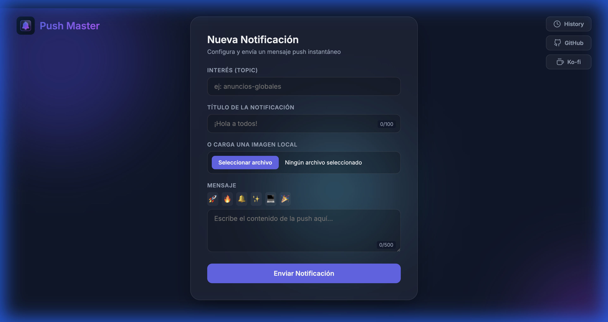
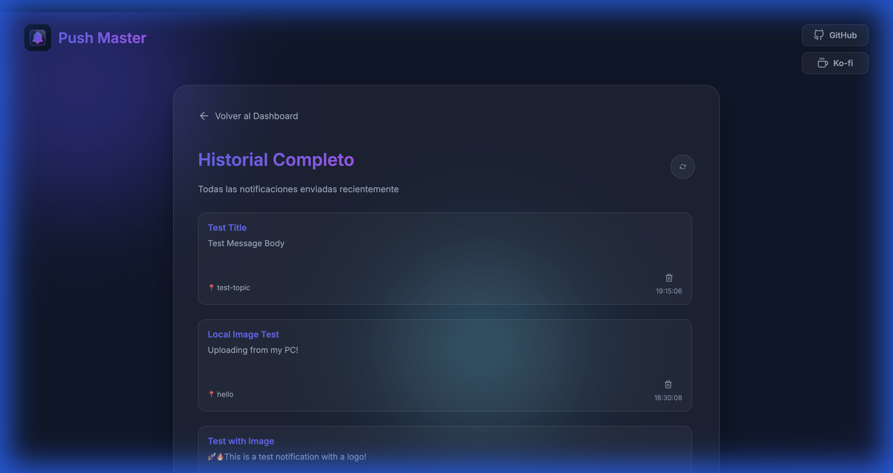

<div align="center">


# Push Master

### Professional Push Notification Management

[](https://opensource.org/licenses/MIT)
[](https://nodejs.org/)
[](http://makeapullrequest.com)
[](https://pusher.com/beams)

**Send instant push notifications to iOS, Android, and Web with a beautiful, modern interface.**

[Live Demo](https://josealvarezdev.github.io/Push-Master/) • [Documentation](DEPLOYMENT.md) • [Report Bug](https://github.com/josealvarezdev/Push-Master/issues) • [Request Feature](https://github.com/josealvarezdev/Push-Master/issues)

</div>

---

## ✨ Features

<table>
<tr>
<td width="50%">

### � Core Features

- **Multi-platform Support** - iOS (APNS), Android (FCM), and Web
- **Rich Notifications** - Titles, messages, emojis, and images
- **Interest-based Targeting** - Send to specific topics/channels
- **Real-time Delivery** - Powered by Pusher Beams infrastructure
- **Notification History** - View and manage last 20 notifications

</td>
<td width="50%">

### 🎨 User Experience

- **Modern UI** - Glassmorphism design with smooth animations
- **Responsive Design** - Optimized for desktop, tablet, and mobile
- **PWA Support** - Install as a native app
- **Accessibility** - ARIA labels, keyboard navigation, screen readers
- **Dark Mode** - Beautiful dark theme by default

</td>
</tr>
</table>

### 🔒 Security & Performance

- ✅ **Input Validation** - Client and server-side validation
- ✅ **XSS Protection** - HTML escaping and sanitization
- ✅ **Rate Limiting** - 100 requests per 15 minutes per IP
- ✅ **File Upload Security** - Type, size, and MIME validation (max 5MB)
- ✅ **Security Headers** - Helmet.js with CSP, HSTS, X-Frame-Options
- ✅ **CORS Configuration** - Restricted to allowed origins
- ✅ **Environment Variables** - Secure API key management

---

## 📸 Screenshots

<div align="center">

### Dashboard


_Modern interface with glassmorphism design_

### Notification History


_Track all sent notifications with timestamps_

</div>

---

## � Quick Start

### Prerequisites

- **Node.js** >= 18.0.0
- **npm** or **yarn**
- **Pusher Beams Account** - [Sign up free](https://pusher.com/beams)

### Installation

```bash
# Clone the repository
git clone https://github.com/josealvarezdev/Push-Master.git
cd Push-Master

# Install dependencies
npm install

# Configure environment variables
cp .env.example .env
# Edit .env with your Pusher Beams credentials

# Start the development server
npm start
```

The application will be available at `http://localhost:3000`

---

## ⚙️ Configuration

### Pusher Beams Setup

1. Create an account at [Pusher Beams Dashboard](https://dashboard.pusher.com/beams)
2. Create a new Beams instance
3. Copy your **Instance ID** and **Secret Key**
4. Add them to your `.env` file

### Environment Variables

```env
PORT=3000
PUSHER_INSTANCE_ID=your_instance_id_here
PUSHER_SECRET_KEY=your_secret_key_here
ALLOWED_ORIGINS=http://localhost:3000
```

> [!IMPORTANT]
> For production deployment, update `ALLOWED_ORIGINS` with your actual domain(s).

---

## 📖 Usage

### Sending a Notification

1. **Open the Dashboard** at `http://localhost:3000`
2. **Fill in the form:**
    - **Interest (Topic)**: Channel identifier (e.g., `global-announcements`)
    - **Title**: Notification title (max 100 characters)
    - **Message**: Notification body (max 500 characters)
    - **Image** (optional): URL or upload a local file
3. **Click "Send Notification"**
4. The notification will be delivered to all devices subscribed to that interest

### Using Emojis

Click the emoji buttons to quickly insert popular emojis into your message:
🚀 🔥 🔔 ✨ 💻 🎉

### Viewing History

- Navigate to the **History** page to see all sent notifications
- View timestamps, content, and metadata
- Delete individual notifications as needed

---

## 🛠️ Development

### Available Scripts

```bash
# Start development server with auto-reload
npm run dev

# Run tests
npm test

# Lint code
npm run lint

# Format code with Prettier
npm run format

# Check for security vulnerabilities
npm audit
```

### Project Structure

```
Push-Master/
├── public/                 # Frontend files
│   ├── index.html         # Main dashboard
│   ├── history.html       # Notification history
│   ├── license.html       # MIT license
│   ├── app.js             # Client-side JavaScript
│   ├── style.css          # Styles with glassmorphism
│   ├── config.js          # Environment configuration
│   ├── manifest.json      # PWA manifest
│   ├── robots.txt         # SEO directives
│   ├── sitemap.xml        # XML sitemap
│   ├── llm.txt            # AI assistant documentation
│   └── logo.png           # Application logo
├── server.js              # Express server
├── .env.example           # Environment template
├── vercel.json            # Vercel deployment config
├── package.json           # Dependencies
├── DEPLOYMENT.md          # Deployment guide
└── README.md              # This file
```

---

## 🚀 Deployment

Push Master requires **two separate deployments**:

1. **Backend** (Node.js server) → Vercel, Railway, or Heroku
2. **Frontend** (Static files) → GitHub Pages, Netlify, or Vercel

### Quick Deploy to Vercel

```bash
# Install Vercel CLI
npm install -g vercel

# Deploy backend
vercel

# Set environment variables in Vercel Dashboard
# Deploy frontend to GitHub Pages (see DEPLOYMENT.md)
```

For detailed deployment instructions, see [DEPLOYMENT.md](DEPLOYMENT.md).

---

## � API Documentation

### Endpoints

#### `GET /health`

Health check endpoint for monitoring.

**Response:**

```json
{
    "status": "ok",
    "timestamp": "2026-01-29T20:00:00.000Z",
    "pusherConfigured": true
}
```

#### `GET /api/config`

Returns Pusher instance ID for client initialization.

#### `POST /api/send`

Send a push notification.

**Body:**

```json
{
    "interest": "global-announcements",
    "title": "Hello World",
    "body": "This is a test notification",
    "image": "https://example.com/image.png"
}
```

**Rate Limit:** 100 requests per 15 minutes

#### `GET /api/history`

Retrieve notification history (last 20).

#### `DELETE /api/history/:id`

Delete a specific notification.

---

## 🔐 Security

Push Master implements industry-standard security practices:

| Feature              | Implementation                                 |
| -------------------- | ---------------------------------------------- |
| **API Keys**         | Environment variables, never exposed to client |
| **Input Validation** | Validator.js library, regex patterns           |
| **XSS Protection**   | HTML escaping, Content Security Policy         |
| **CSRF Protection**  | Not needed (API-only, no cookies)              |
| **Rate Limiting**    | Express-rate-limit middleware                  |
| **File Upload**      | Multer with type/size validation               |
| **Security Headers** | Helmet.js (HSTS, CSP, X-Frame-Options)         |
| **CORS**             | Restricted to allowed origins                  |

---

## 🌐 SEO & Discoverability

Optimized for search engines and AI assistants:

- ✅ **Meta Tags** - Open Graph, Twitter Cards
- ✅ **Structured Data** - JSON-LD schema.org markup
- ✅ **Sitemap** - XML sitemap for search engines
- ✅ **robots.txt** - Search engine directives
- ✅ **llm.txt** - AI assistant documentation (ChatGPT, Claude, Gemini)
- ✅ **humans.txt** - Developer attribution

---

## 🤝 Contributing

Contributions are welcome! Please follow these steps:

1. **Fork** the repository
2. **Create** a feature branch (`git checkout -b feature/AmazingFeature`)
3. **Commit** your changes (`git commit -m 'Add some AmazingFeature'`)
4. **Push** to the branch (`git push origin feature/AmazingFeature`)
5. **Open** a Pull Request

Please ensure your code:

- Follows the existing code style
- Includes tests for new features
- Updates documentation as needed

---

## 📄 License

This project is licensed under the **MIT License** - see the [LICENSE](https://josealvarezdev.github.io/Push-Master/license.html) file for details.

---

## 👤 Author

**Jose Alvarez**

- 🌐 Website: [josealvarezdev.github.io/Push-Master](https://josealvarezdev.github.io/Push-Master/)
- 💻 GitHub: [@josealvarezdev](https://github.com/josealvarezdev)
- ☕ Ko-fi: [josealvarezdev](https://ko-fi.com/josealvarezdev)

---

## 🙏 Acknowledgments

- [Pusher Beams](https://pusher.com/beams) - Reliable push notification infrastructure
- [Inter Font](https://fonts.google.com/specimen/Inter) - Beautiful typography
- [Helmet.js](https://helmetjs.github.io/) - Security headers
- [Express.js](https://expressjs.com/) - Web framework
- [Multer](https://github.com/expressjs/multer) - File upload handling

---

## 📊 Stats


---

## 🗺️ Roadmap

- [ ] Multi-language support (i18n)
- [ ] Notification templates
- [ ] Scheduled notifications
- [ ] Analytics dashboard
- [ ] Bulk notification sending
- [ ] A/B testing for notifications
- [ ] User segmentation
- [ ] Notification preview

---

<div align="center">

### ⭐ Star this repository if you found it helpful! Thank you!!!

**by [Jose Alvarez](https://github.com/josealvarezdev)**

[⬆ Back to Top](#push-master)

</div>
